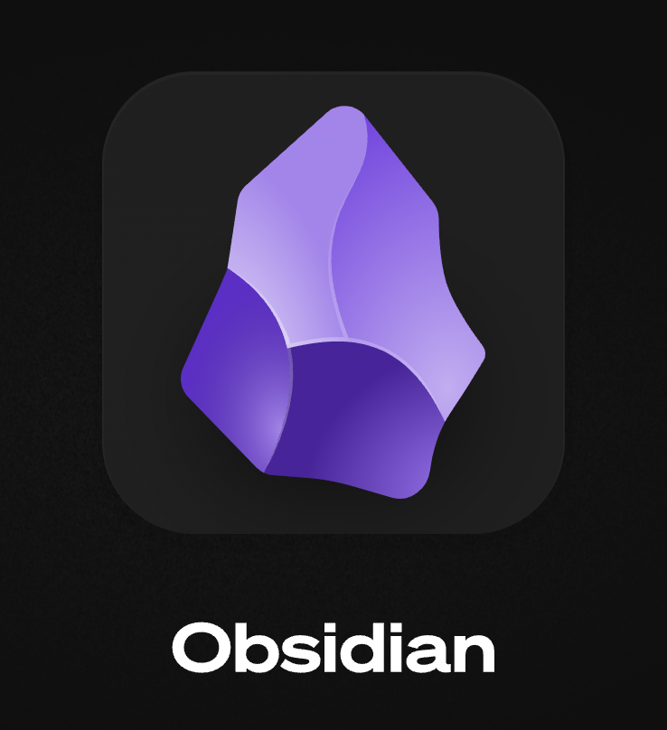

# Obsidian Slashpage Publisher

  
  

A plugin for publishing your Obsidian notes directly to [Slashpage](https://slashpage.com) using their Webhook API.

> **Important**: Before using this plugin, you must apply to become a beta tester at [https://slashpage.com/slashpage-kr/betatester](https://slashpage.com/slashpage-kr/betatester) to get access to Slashpage's Webhook API. You can find documentation about the Webhook API at [https://help.slashpage.com/integration-webhook](https://help.slashpage.com/integration-webhook). The plugin will not work without a valid webhook token.
>
> **Note**: This plugin is currently in development and not yet released. It requires access to Slashpage's beta Webhook API. Once the API access is approved, the plugin will be completed and released.

## Features

- Publish Obsidian notes to Slashpage with a single click
- Preserve markdown formatting when publishing
- Simple configuration interface
- Publish to different Slashpage channels based on folder paths
- Accessible via ribbon icon or command palette

## Installation

This plugin is not yet available in the Obsidian Community Plugins directory. Once released:

1. In Obsidian, go to Settings > Community plugins > Browse
2. Search for "Slashpage Publisher"
3. Click Install, then Enable

## Configuration

1. In Obsidian, go to Settings > Community plugins > Slashpage Publisher > Settings button

### Default Settings

Enter the following information:
- **Default Domain Name**: Your Slashpage domain name (e.g., `my-domain`)
- **Default Channel Hash**: The hash of the Slashpage channel you want to publish to
- **Default Token Key**: Your Slashpage webhook token key

### Folder-specific Channel Settings

To publish notes from specific folders to different Slashpage channels:

1. Click the 'Add Folder Mapping' button
2. Enter the following information:
   - **Folder Path**: The folder path to map (e.g., `projects/blog`)
   - **Domain Name**: The Slashpage domain name for this folder
   - **Channel Hash**: The channel hash for this folder
   - **Token Key**: The token key for this folder

You can add multiple folder mappings. The plugin will automatically use the most specific mapping that matches the path of the note being published.

### Setting up Slashpage Webhook

**⚠️ REQUIRED BEFORE USING THE PLUGIN:**

1. Apply to become a beta tester at [https://slashpage.com/slashpage-kr/betatester](https://slashpage.com/slashpage-kr/betatester) to get access to the Webhook API
2. Wait for approval from the Slashpage team
3. Once approved, log in to Slashpage
4. In the channel you want to publish to, click `•••` in the top right of the edit screen, then select `Channel Settings`
5. In the `Webhook Token Management` menu, click `Add New Key`
6. Select a profile, and a token key will be generated
7. Copy this token key for use in the plugin settings

### Publishing Notes

1. Open the markdown note you want to publish
2. Publish using one of these methods:
   - Click the paper airplane icon in the left ribbon menu
   - Run the "Publish to Slashpage" command from the command palette (Ctrl/Cmd+P)

## Important Notes

- **This plugin will not work without Webhook API access** - you must apply to become a beta tester first at [https://slashpage.com/slashpage-kr/betatester](https://slashpage.com/slashpage-kr/betatester)
- For documentation about the Webhook API, visit [https://help.slashpage.com/integration-webhook](https://help.slashpage.com/integration-webhook)
- The Webhook API is currently in beta and requires explicit approval from the Slashpage team
- You will need three pieces of information to configure the plugin:
  1. Your Slashpage domain name
  2. The channel hash (found in channel settings)
  3. The webhook token key (generated after API access approval)
- The plugin will be fully completed once webhook API access is approved

## License

MIT License

---

# 옵시디언 Slashpage 퍼블리셔

  
  

[Slashpage](https://slashpage.com)의 웹훅 API를 사용하여 옵시디언 노트를 직접 발행할 수 있는 플러그인입니다.

> **중요**: 이 플러그인을 사용하기 전에 반드시 [https://slashpage.com/slashpage-kr/betatester](https://slashpage.com/slashpage-kr/betatester)에서 베타테스터로 신청하여 Slashpage의 웹훅 API 접근 권한을 받아야 합니다. 웹훅 API에 관한 문서는 [https://help.slashpage.com/integration-webhook](https://help.slashpage.com/integration-webhook)에서 확인할 수 있습니다. 유효한 웹훅 토큰 없이는 플러그인이 작동하지 않습니다.
>
> **참고**: 이 플러그인은 현재 개발 중이며 아직 출시되지 않았습니다. Slashpage의 베타 웹훅 API 접근 권한이 필요합니다. API 접근이 승인되면 플러그인 개발을 완료하고 출시할 예정입니다.

## 기능

- 옵시디언 노트를 Slashpage에 원클릭으로 발행
- 마크다운 형식 그대로 Slashpage에 게시
- 간편한 설정 인터페이스
- 폴더별 다른 Slashpage 채널로 발행 가능
- 리본 아이콘 또는 명령어 팔레트를 통한 접근

## 설치 방법

이 플러그인은 아직 옵시디언 커뮤니티 플러그인 디렉토리에서 사용할 수 없습니다. 출시 후:

1. 옵시디언에서 설정 > 커뮤니티 플러그인 > 찾아보기로 이동하세요.
2. "Slashpage Publisher"를 검색하세요.
3. 설치 버튼을 클릭한 다음 활성화하세요.

## 설정

1. 옵시디언에서 설정 > 커뮤니티 플러그인 > Slashpage Publisher > 설정 버튼을 클릭하세요.

### 기본 설정

다음 정보를 입력하세요:
- **기본 도메인 이름**: Slashpage 도메인 이름 (예: `my-domain`)
- **기본 채널 해시**: 발행할 Slashpage 채널의 해시 값
- **기본 토큰 키**: Slashpage 웹훅 토큰 키

### 폴더별 채널 설정

특정 폴더의 노트를 다른 Slashpage 채널로 발행하고 싶을 때 사용합니다:

1. '폴더 매핑 추가' 버튼을 클릭합니다.
2. 다음 정보를 입력합니다:
   - **폴더 경로**: 매핑할 폴더 경로 (예: `projects/blog`)
   - **도메인 이름**: 이 폴더에 사용할 Slashpage 도메인 이름
   - **채널 해시**: 이 폴더에 사용할 채널 해시
   - **토큰 키**: 이 폴더에 사용할 토큰 키

여러 폴더 매핑을 추가할 수 있으며, 파일이 있는 경로와 가장 일치하는 매핑이 자동으로 선택됩니다.

### Slashpage 웹훅 설정 방법

**⚠️ 플러그인 사용 전 필수 단계:**

1. [https://slashpage.com/slashpage-kr/betatester](https://slashpage.com/slashpage-kr/betatester)에서 베타테스터로 신청하여 웹훅 API 접근 권한을 받습니다.
2. Slashpage 팀의 승인을 기다립니다.
3. 승인이 완료되면 Slashpage에 로그인합니다.
4. 발행할 채널에서 편집 화면 오른쪽 위 `•••` 클릭 후 `채널 설정`을 선택합니다.
5. `웹훅 토큰 관리` 메뉴에서 `새로운 키 추가`를 클릭합니다.
6. 프로필을 선택하면 토큰 키가 발급됩니다.
7. 이 토큰 키를 복사하여 플러그인 설정에 사용합니다.

### 노트 발행하기

1. 발행하려는 마크다운 노트를 엽니다.
2. 다음 방법 중 하나로 발행할 수 있습니다:
   - 왼쪽 리본 메뉴에서 종이비행기 아이콘 클릭
   - 명령어 팔레트(Ctrl/Cmd+P)에서 "Slashpage에 발행하기" 명령 실행

## 주의사항

- **웹훅 API 접근 권한 없이는 플러그인이 작동하지 않습니다** - 반드시 [https://slashpage.com/slashpage-kr/betatester](https://slashpage.com/slashpage-kr/betatester)에서 베타테스터로 먼저 신청해야 합니다.
- 웹훅 API에 관한 문서는 [https://help.slashpage.com/integration-webhook](https://help.slashpage.com/integration-webhook)에서 확인할 수 있습니다.
- 웹훅 API는 현재 베타 버전이며 Slashpage 팀의 명시적인 승인이 필요합니다.
- 플러그인 설정을 위해 다음 세 가지 정보가 필요합니다:
  1. Slashpage 도메인 이름
  2. 채널 해시 (채널 설정에서 확인 가능)
  3. 웹훅 토큰 키 (API 접근 승인 후 발급)
- 웹훅 API 접근이 승인되면 플러그인 개발이 완료될 예정입니다.

## 라이선스

MIT 라이선스

---

  

